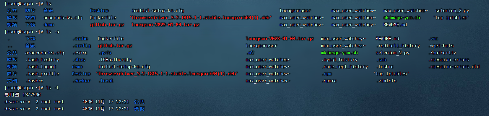
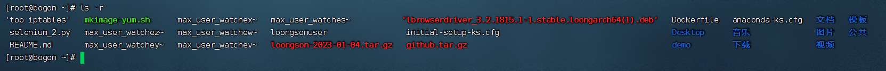
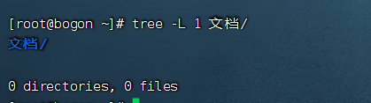
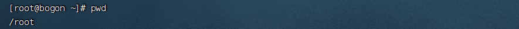
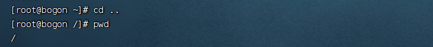
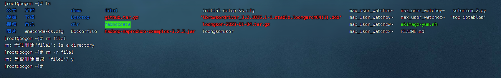
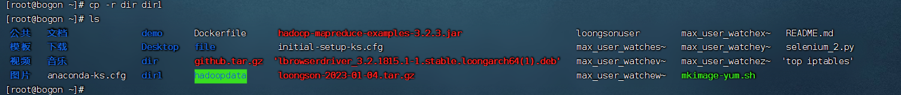

### 一、实验目的


### 二、实验准备
* 用户devuser密码：devuser
* 安装git命令：sudo apt install git

### 三、基本命令
#### 1、文件目录操作命令
##### ls命令
* ls：用于列出指定文件或目录的相关信息
* ls -a：列出当前目录的所有文件，包含隐藏文件
* ls -l：以列表形式列出当前目录的所有文件，包含隐藏文件
* ls -R：递归列出当前目录中的子目录
<table>
    <tr>
        <td></td>
    </tr>
    <tr>
        <td></td>
    </tr>
</table>

##### 2、tree命令
* tree命令用于以树形方式显示目录内容，该命令的典型选项 -L level表示列出指定目录下的第level层
* 示例：列出“文档”目录下第1层的内容
```
tree -L 1 文档/
```

<table>
    <tr>
        <td></td>
    </tr>
</table>
采用tree命令的-N选项，解决中文显示乱码问题

```
tree -N
```


##### 3、pwd命令
* pwd命令用于显示当前工作目录
<table>
    <tr>
        <td></td>
    </tr>
</table>


##### 4、cd命令
* cd命令用于切换工作目录
示例：切换至当前用户的”home“目录
```agsl
cd ..
pwd
```

<table>
    <tr>
        <td></td>
    </tr>
</table>

##### 5、mkdir命令
* mkdir命令用于创建一个新的目录。加选项-p可递归创建目录
示例：创建多级目录
```
mkdir -p dir/dir1
tree -1
```

##### 6、touch命令
* touch命令用于更新时间戳，如果文件不存在，会创建一个新文件
* touch [选项] 文件
* touch命令的典型选项解释如下
* -a：只更改访问时间
* -c：不创建任何文件
* -d：使用指定字符串表示时间而非当前时间

##### 7、rm命令
* rm命令用于删除文件或目录，使用rm命令要小心，因为文件删除后不能恢复。可以在rm后添加-i选项，以交互方式逐个确认要删除的文件
* rm [选项] 文件
* -i：交互的方式执行
* -r：递归地删除目录下的的内容，删除文件夹时必须加此选项
* -f：强制删除，忽略不存在的文件，无须提示
<table>
    <tr>
        <td></td>
    </tr>
</table>


##### 8、cp命令
* cp命令用于将给定的文件或目录复制到另一个文件或目录中，相当于DOS中的copy命令
* cp [选项] [-T] 源文件 目标文件
* cp [选项] 源文件目录
* cp [选项] -t 目录源文件
* cp命令典型选项解释如下
* -a：该选项通常在复制目录时使用，它保留链接、文件属性，并递归地复制目录。简单而言，它可以保持稳健原有属性
* -f：直接覆盖已经存在的目标文件而不提示
* -i：交互式复制，在覆盖目标文件之前将给出提示，并要求用户确认
* -r：若给出的源文件就是目录文件，则递归复制该目录下的所有子目录和文件
* -v：显示复制进度
###### 复制文件file
```
cp  file file1
ls
```
###### 复制目录dir
```
cp  -r dir dir1
ls
```
<table>
    <tr>
        <td></td>
    </tr>
</table>


##### 9、mv命令
* mv命令用于移动文件或目录，也可用于重命名文件或目录
* mv [选项]....[-T] 源文件目标文件
* mv [选项]...源文件...目录
* mv [选项]...-t 目录源文件
* mv命令典型选项解释如下
* -f: 禁止交互式操作，如有覆盖也不会给出提示
* -i：交互式操作，如果执行mv命令NAMEK_将覆盖已存在的目标文件，系统会提示是否重写，要求用户确认以避免误覆盖文件
* -v：显示移动进度
* 示例：将文件”file“更名为“file2”
```
mv file file2
```
##### 10、in命令
* in [选项]... [-T] TAGET LINK_NAME
* in命令典型选项-s表示创建符号链接
```
ls -l
in -s file2 file1
ls -l
```

